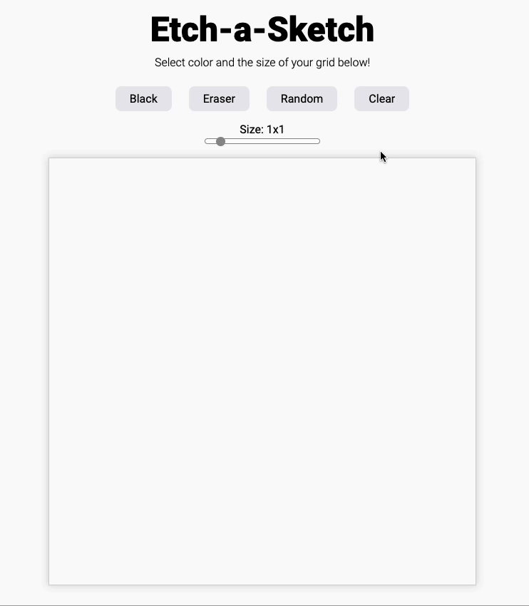

</img>

<h1 align="center">Meet Landing Page</h1>

  <h3>
    <a href="https://waynetasaki.github.io/meet-landing-page/">🌐 Live Site </a>  |  
    <a href="https://www.frontendmentor.io/solutions/equalizer-landing-page-responsive-design-flexbox-css-clamp-uLSRKjJ3B"> Solution </a> | 
    <a href="https://www.frontendmentor.io/challenges/meet-landing-page-rbTDS6OUR"> Challenge </a> 
  </h3>

   Solution for a challenge from  <a href="https://www.frontendmentor.io/" target="_blank">frontendmentor.io</a>.

 

## About This Project

This challenge will be a perfect test of your HTML & CSS skills. If you're starting to get comfortable building smaller projects, this will be a great step up.

The challenge is to build out this landing page and get it looking as close to the design as possible.
You can use any tools you like to help you complete the challenge. So if you've got something you'd like to practice, feel free to give it a go.
 
 
Your users should be able to:
1. View the optimal layout depending on their device's screen size
2. See hover states for interactive elements

 
 

## Built with

HTML, CSS

## What I learned
- The hero section was difficult to build. After searching online, I figured Float was the best option to split the left and right hero image. Responsiveness is a little wacky at around the 1100px mark but I couldn't think of another way to do it because the tablet and mobile hero image was too small and I couldn't get the whole section to scale down before the tablet and mobile hero image would work. 
